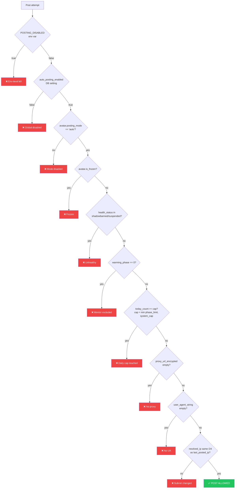
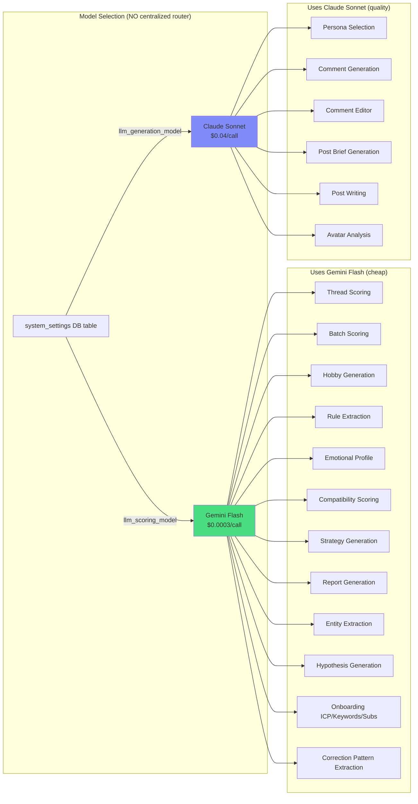
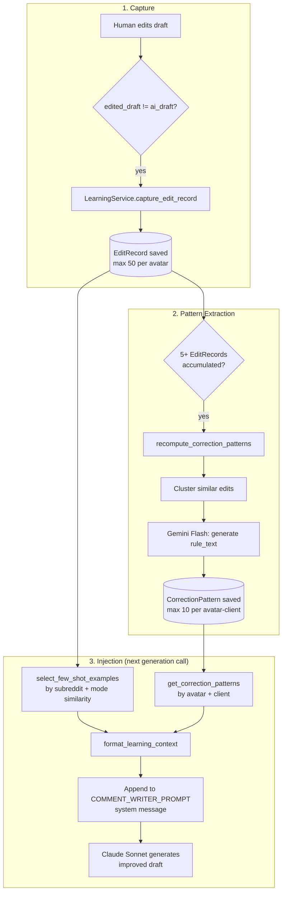
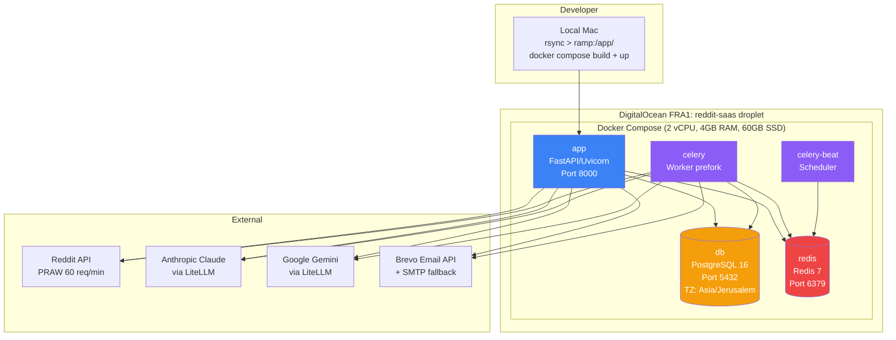

> **What this is:** Safety diagrams (9 posting gates), AI model routing, learning loop, and deployment.
> **Data source:** services/posting_safety.py (gates), services/ai.py + config.py (model routing), services/learning.py (loop), docker-compose.yml (deployment).
> **IMPORTANT:** 5 containers (NOT 6). Email via Brevo (NOT SendGrid). Kill switch propagation up to 5 m (not instant).

---

# Safety & AI Diagrams (Correct)

## Posting Safety Gates (9 Sequential Checks)

## AI Model Routing Map

## Learning Loop Flow

## Deployment (5 containers, CORRECT)

**NOTE:** There is NO `celery-fast` container. ONE queue (default). ONE worker process. Beat is scheduler, not queue.
