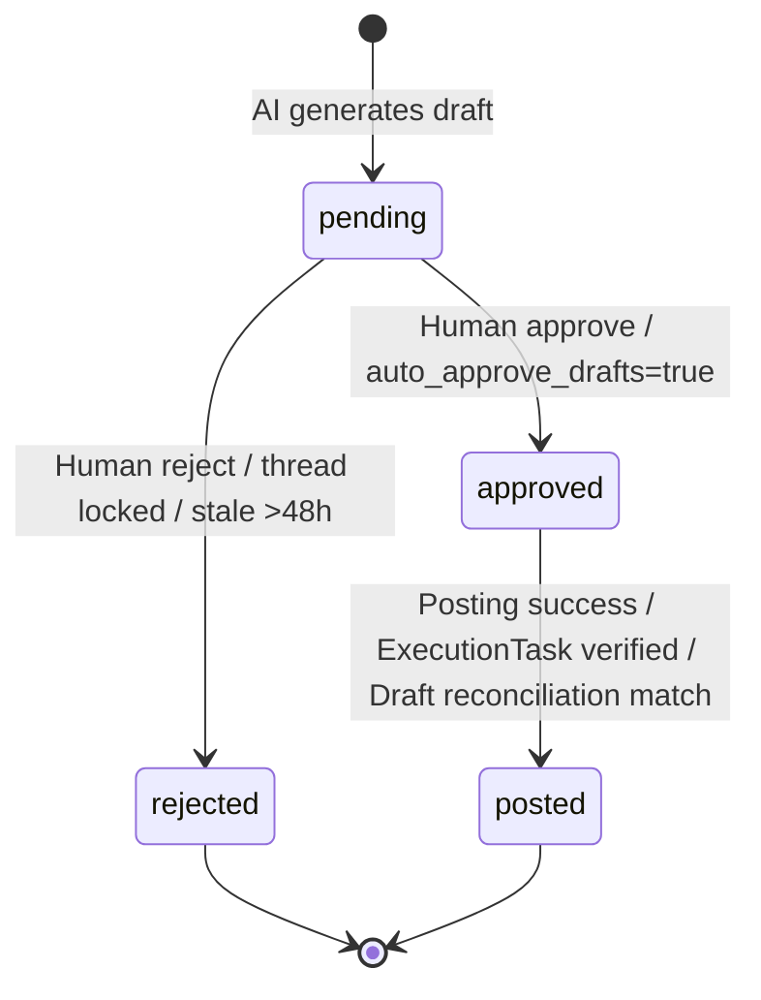
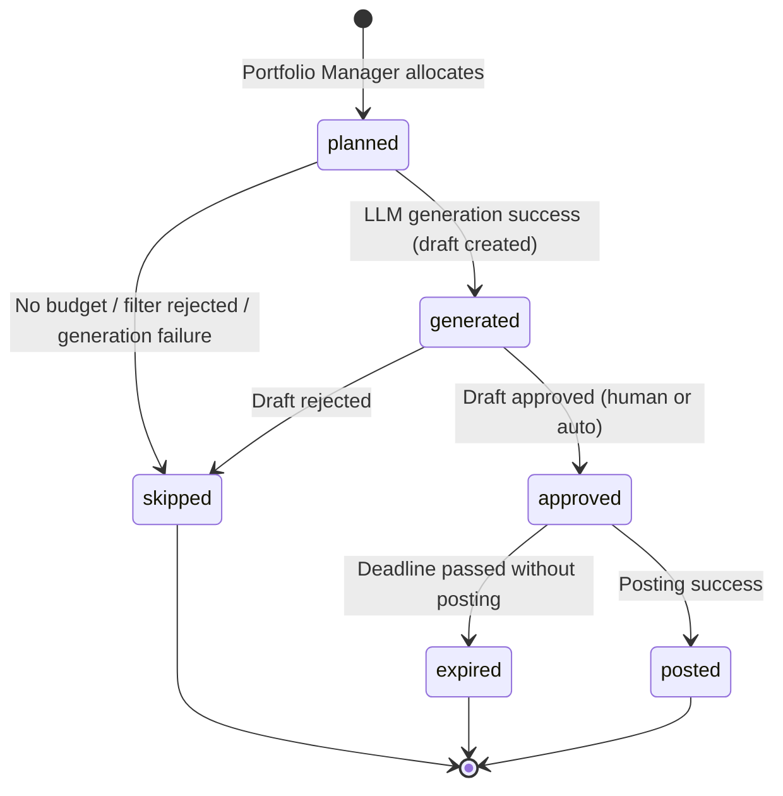

> **What this is:** 5 correct state machine diagrams (Mermaid) for core RAMP entities.
> **Data source:** Extracted from production code (SQLAlchemy models + services/phase.py + services/health_checker.py + services/posting.py).
> **How to Use:** Paste code into [mermaid.live](https://mermaid.live) or any Markdown renderer.
> **IMPORTANT:** Expert phase (authority > 75) NOT implemented — spec only. Phase demotion threshold = 70% (not 80%).

---

# State Machine Diagrams (Correct)

## CommentDraft Lifecycle



## EPGSlot Lifecycle



## ExecutionTask Lifecycle

```mermaid
stateDiagram-v2
    [*] --> generated : Created on draft approve
    generated --> emailed : dispatch_due_email_tasks (scheduled_at within window)
    emailed --> accepted : Executor clicks action link
    accepted --> submitted : Executor submits Reddit URL
    submitted --> verified : URL + content verification pass
    generated --> expired : Deadline passed (23:30 daily)
    emailed --> expired : Deadline passed
    accepted --> expired : Deadline passed
    submitted --> failed : Verification mismatch
    generated --> cancelled : Admin cancellation
    emailed --> cancelled : Admin cancellation
    verified --> [*]
    failed --> [*]
    expired --> [*]
    cancelled --> [*]

    note right of generated : Max 3 deliveries, min 10min apart
    note right of expired : expire_overdue_execution_tasks (23:30)
```

## Avatar Phase System

```mermaid
stateDiagram-v2
    [*] --> phase_0 : Fresh account (karma<10, age<14d)
    [*] --> phase_1 : Pre-warmed account (karma≥10 or age≥14d)

    phase_0 --> phase_1 : Graduation: age≥7d, karma≥10, 3 posted, 0 deleted
    phase_1 --> phase_2 : Promotion (daily 06:00 eval)\nage≥60d, karma≥100, activity≥20, survival≥80%, diversity≥2
    phase_2 --> phase_3 : Promotion\nage≥150d, karma≥500, activity≥50, survival≥85%, avg_score≥2.0

    phase_1 --> phase_0 : Demotion: shadowban / survival <70% / CQS lowest
    phase_2 --> phase_0 : Demotion: shadowban / CQS lowest / survival <70%
    phase_3 --> phase_0 : Demotion: shadowban / CQS lowest
    phase_3 --> phase_2 : Demotion: karma drop (avg < -2, 14d)
    phase_2 --> phase_1 : Demotion: karma drop (avg < -2, 14d)

    phase_0 --> frozen : Timeout >30d without graduation OR suspended (404/403)

    note left of phase_0 : Incubation: 1/day, safe subs, mandatory approval\nAlso recovery destination (replaces freeze)
    note left of phase_1 : Hobby only, zero brand, 1-3/day
    note left of phase_2 : Professional + hobby, 7/day
    note left of phase_3 : Brand allowed (ratio-gated), 18/day
```

**Mentor** is NOT a phase. Mentor = `avatar.pool == "mentor"` (excluded from all pipelines independently of phase).

**Key architectural change (June 27 spec):** Shadowban/CQS-lowest → demote to Phase 0 (NOT freeze). Avatar stays in pipeline with 1/day probe activity. Health checks continue. Recovery is automatic. Freeze reserved for suspended (404/403) or Phase 0 timeout >30d.

**NOTE:** Expert phase (authority_score > 75) is PLANNED but NOT IMPLEMENTED in production code.

## Avatar Health

```mermaid
stateDiagram-v2
    [*] --> unknown : Initial state
    unknown --> active : Health check confirms profile accessible
    active --> shadowbanned : Profile inaccessible (health_check 07:30/13:30)
    active --> suspended : Reddit API 403/404 on profile
    active --> limited : Partial restrictions detected
    shadowbanned --> active : Health check detects visibility restored
    limited --> active : Restrictions lifted

    note right of shadowbanned : Side effects:\n- avatar.is_shadowbanned = True\n- demote to Phase 0 (NOT freeze)\n- cancel pending ExecutionTasks\n- 1/day probe activity continues\n- recovery auto-detected
    note right of suspended : Side effects:\n- avatar.is_frozen = True (only real freeze)\n- emit notification
```
