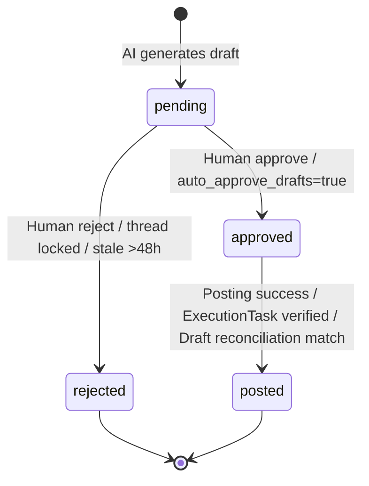
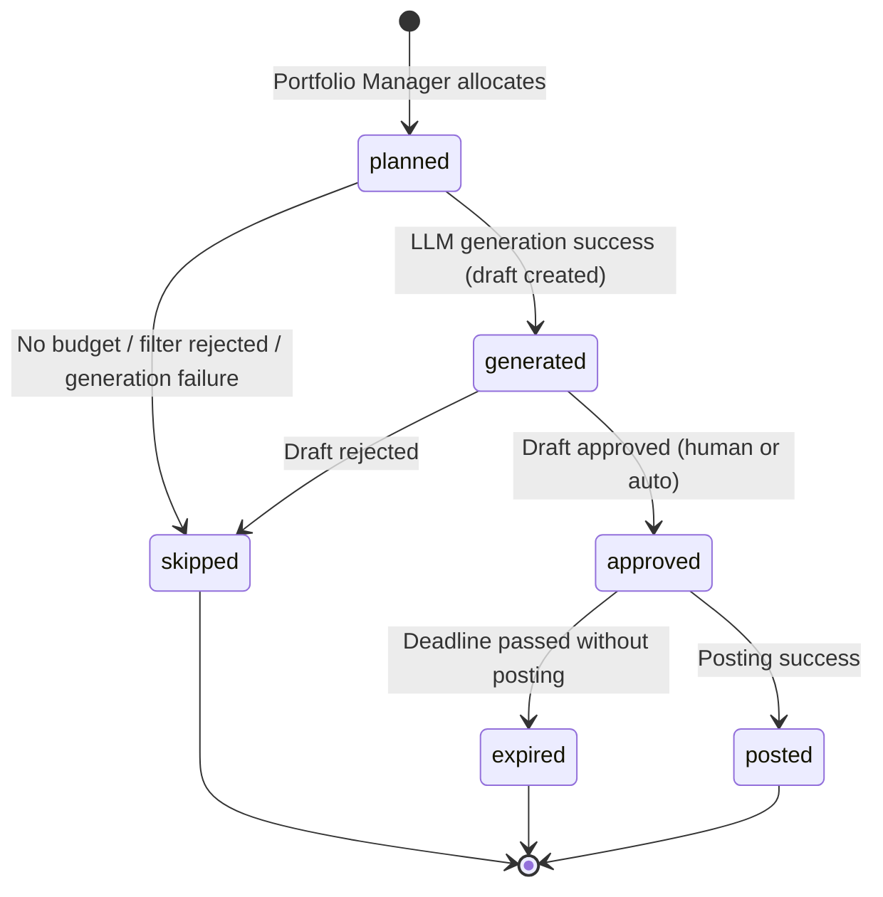

> **What this is:** 5 correct state machine diagrams (Mermaid) for core RAMP entities.
> **Data source:** Extracted from production code (SQLAlchemy models + services/phase.py + services/health_checker.py + services/posting.py).
> **How to Use:** Paste code into [mermaid.live](https://mermaid.live) or any Markdown renderer.
> **IMPORTANT:** Expert phase (authority > 75) NOT implemented — spec only. Phase demotion threshold = 70% (not 80%).

---

# State Machine Diagrams (Correct)

## CommentDraft Lifecycle



## EPGSlot Lifecycle



## ExecutionTask Lifecycle

```mermaid
stateDiagram-v2
    [*] --> generated : Created on draft approve
    generated --> emailed : dispatch_due_email_tasks (scheduled_at within window)
    emailed --> accepted : Executor clicks action link
    accepted --> submitted : Executor submits Reddit URL
    submitted --> verified : URL + content verification pass
    generated --> expired : Deadline passed (23:30 daily)
    emailed --> expired : Deadline passed
    accepted --> expired : Deadline passed
    submitted --> failed : Verification mismatch
    generated --> cancelled : Admin cancellation
    emailed --> cancelled : Admin cancellation
    verified --> [*]
    failed --> [*]
    expired --> [*]
    cancelled --> [*]

    note right of generated : Max 3 deliveries, min 10min apart
    note right of expired : expire_overdue_execution_tasks (23:30)
```

## Avatar Phase System

```mermaid
stateDiagram-v2
    [*] --> phase_1 : Default on creation

    phase_1 --> phase_2 : Promotion (daily 06:00 eval)\nPer-phase criteria in PhaseEvaluator
    phase_2 --> phase_3 : Promotion
    phase_2 --> phase_1 : Demotion: survival <70% (7d, min 5 samples)\nOR avg karma < -2 (14d)
    phase_3 --> phase_2 : Demotion (same rules)

    state phase_0_mentor {
        [*] : Excluded from ALL automation
        note : Admin Phase Override ONLY
    }

    note left of phase_1 : Hobby only, zero brand, 1-3/day
    note left of phase_2 : Professional + hobby, 5-15/day
    note left of phase_3 : Brand allowed (ratio-gated)

    phase_1 --> phase_1 : Shadowban detected → stays Phase 1 + freeze
    phase_2 --> phase_1 : Shadowban detected → demote + freeze
    phase_3 --> phase_1 : Shadowban detected → demote + freeze
```

**NOTE:** Expert phase (authority_score > 75) is PLANNED but NOT IMPLEMENTED in production code.

## Avatar Health

```mermaid
stateDiagram-v2
    [*] --> unknown : Initial state
    unknown --> active : Health check confirms profile accessible
    active --> shadowbanned : Profile inaccessible (health_check 07:30/13:30)
    active --> suspended : Reddit API 403/404 on profile
    active --> limited : Partial restrictions detected
    shadowbanned --> active : Appeal successful (subsequent check passes)
    limited --> active : Restrictions lifted

    note right of shadowbanned : Side effects:\n- avatar.is_frozen = True\n- demote to Phase 1\n- cancel all ExecutionTasks\n- emit notification
    note right of suspended : Side effects:\n- avatar.is_frozen = True\n- emit notification
```
